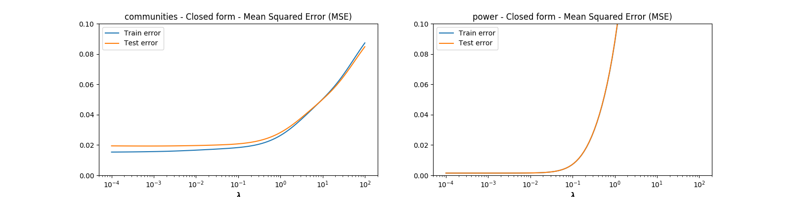
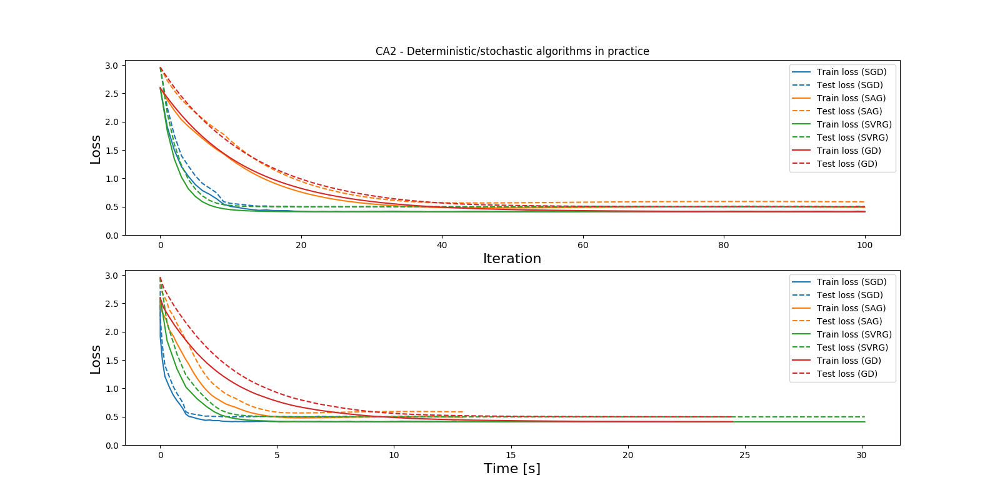

# Computer Assignments in EP3260: Fundamentals of Machine Learning Over Networks

## TL;DR;

1. Install dependencies by running `pip install -r requirements.txt`.
2. Run `make` to download all the data and run the code, or just `make dataset` to download the data.

## Assignment 1 - Closed-form solution vs iterative approaches

Defined in [Lecture 3](https://drive.google.com/file/d/1DVaRsAtkRwbf_Ecrhm3SMF6ecsW7Eier/)
    
1. Find a closed-form solution for this problem
    - Closed-form solution is $`w=(X^TX+\frac{N}{2}\lambda{}I)^{-1} X^TY`$.
2. Consider “Communities and Crime” dataset (N = 1994, d = 128) and find the optimal linear regressor from the closed-form expression. 
    - Implemented using `numpy` using the closed form expression.

3. Repeat 2) for “Individual household electric power consumption” dataset (N = 2075259, d = 9) and observe the scalability issue of the closed-form expression.
     - Implemented using `numpy` using the closed form expression.
    
4. How would you address even bigger datasets?
    - Sampling of data points (minibatches, average solutions). Should work if batchs are big enough.
    - Use solvers such as SGD.

## Assignment 2 - Deterministic/stochastic algorithms in practice

Defined in [Lecture 3](https://drive.google.com/file/d/1DVaRsAtkRwbf_Ecrhm3SMF6ecsW7Eier/)

Consider logistic ridge regression $`f(\mathbf{w}) = \frac{1}{N} \sum_{i \in [N]} f_i(\mathbf{w}) + \lambda \Vert \mathbf{w} \Vert_2^2`$ , where $`f_i(\mathbf{w})= \log (1 + \exp\{-y_i\mathbf{w}^T\mathbf{x}_i\}) `$ for the Individual household electric power consumption.

1. Solve the optimization problem using GD, stochastic GD, SVRG, and SAG

2. Tune a bit hyper-parameters (including $`\lambda`$)

See branch `runs` for details. Use `./run_all.sh` to generate data.

| Solver     | learning_rate   | lambda     | best_test_loss  |
| ---------- | --------------- | ---------- | --------------- |
| SAG        | 0.01            | 0.1        | 0.203           |
| SAG        | 0.001           | 0.1        | 0.203           |
| SAG        | 0.001           | 0.01       | 0.204           |
| SAG        | 0.01            | 0.01       | 0.206           |
| SGD        | 0.1             | 0.1        | 0.209           |
| SGD        | 0.1             | 0.01       | 0.211           |
| SAG        | 0.1             | 0.01       | 0.216           |
| SAG        | 0.1             | 0.1        | 0.217           |
| SGD        | 0.01            | 0.1        | 0.217           |
| SGD        | 0.01            | 0.01       | 0.217           |
| SGD        | 0.001           | 0.1        | 0.22            |
| SGD        | 0.001           | 0.01       | 0.22            |
| SVRG       | 0.1             | 0.1        | 0.222           |
| SVRG       | 0.1             | 0.1        | 0.222           |
| SVRG       | 0.1             | 0.1        | 0.222           |
| SVRG       | 0.1             | 0.1        | 0.222           |
| SVRG       | 0.1             | 0.1        | 0.222           |
| SVRG       | 0.1             | 0.01       | 0.222           |
| SVRG       | 0.1             | 0.01       | 0.222           |
| SVRG       | 0.1             | 0.01       | 0.222           |

3. Compare these solvers in terms complexity of hyper-parameter tuning, convergence time, convergence rate (in terms of # outer-loop iterations), and memory requirement.

See figure above for convergence time (including calculating cost for training and test sets.)

| Solver | Convergence time | Convergence rate |               Memory req.                |      |
|--------|------------------|------------------|------------------------------------------|------|
| SGD    | See fig.         | See fig.         | 1                                        |      |
| SAG    | See fig.         | See fig.         | N                                        |      |
| SVRG   | See fig.         | See fig.         | One memory, two gradients per inner loop |      |
| GD     | See fig.         | See fig.         | N                                        | ---- |

## Datasets

|                     Dataset                     | # Instances | # Attributes |
|-------------------------------------------------|-------------|--------------|
| Communities and Crime Data Set                  |        1994 |          128 |
| Individual household electric power consumption |     2075259 |            9 |

### Communities and Crime Data

[Communities and Crime Data Set ](http://archive.ics.uci.edu/ml/datasets/communities+and+crime)
 
Communities within the United States. The data combines socio-economic data from the 1990 US Census, law enforcement data from the 1990 US LEMAS survey, and crime data from the 1995 FBI UCR.

### Individual household electric power consumption
 
[Individual household electric power consumption Data Set ](https://archive.ics.uci.edu/ml/datasets/individual+household+electric+power+consumption)

Measurements of electric power consumption in one household with a one-minute sampling rate over a period of almost 4 years. Different electrical quantities and some sub-metering values are available.
    

## Links

- https://github.com/vbordalo/Communities-Crime/blob/master/Crime_v1.ipynb
- https://cvxopt.org/index.html
- https://github.com/cvxgrp/cvxpy/blob/master/examples/machine_learning/ridge_regression.ipynb
- https://www.quora.com/What-is-ridge-regression-How-do-you-find-its-closed-form-solution
